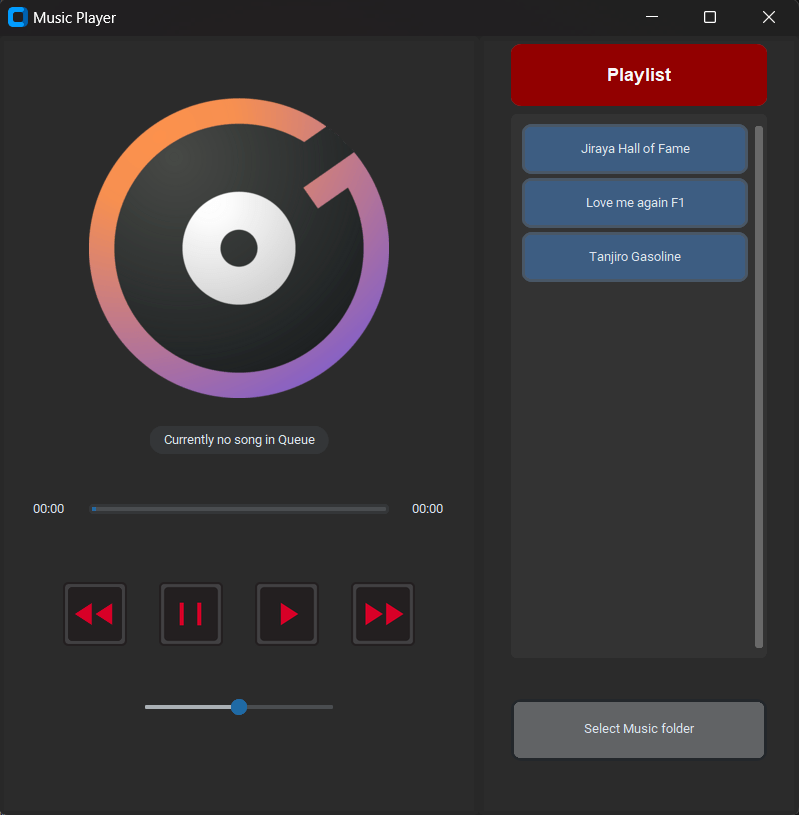

# Music Player

This is a simple music player application developed using Python and the Tkinter library. It allows users to play, pause, skip, and adjust the volume of music tracks. The application also displays a playlist of songs that can be selected for playback.

## Screenshots



## Features

- Play, pause, and skip functionality
- Volume adjustment using a slider
- Display of the currently playing track
- Playlist view with the ability to select songs

## Requirements

Make sure you have the following dependencies installed:

- Python 3.x
- Tkinter
- Customtkinter
- Pillow (PIL)
- Pygame
- Mutagen

You can install the required packages using the following command:

```
pip install pillow pygame mutagen customtkinter tkinter
```

## Usage

1. Run the `MusicPlayer.py` script to launch the music player application.
2. The main window is divided into two frames: the player frame and the playlist frame.
3. In the player frame, you can control the playback, adjust the volume, and view the currently playing track.
4. The playlist frame displays the available songs in the selected music folder. Use the "Select Music folder" button to choose a directory containing your music files.
5. Click on a song in the playlist to play it.

## Credits

Icons used by [surang](https://www.freepik.com/author/surang/icons/surang-red_752?t=f#from_element=resource_detail).

